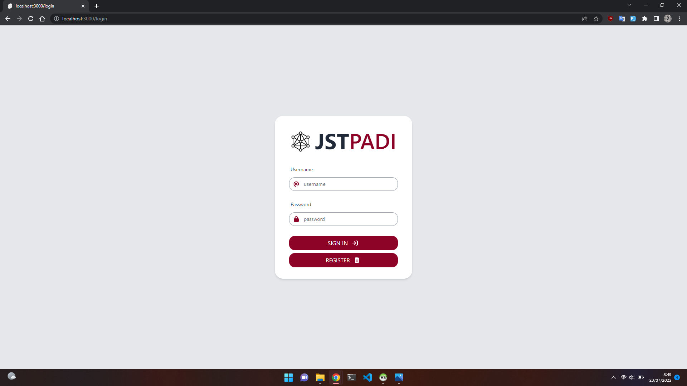
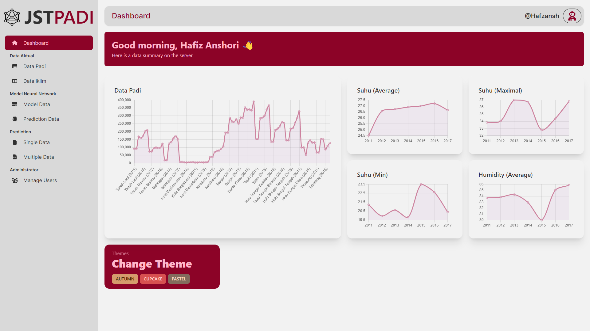
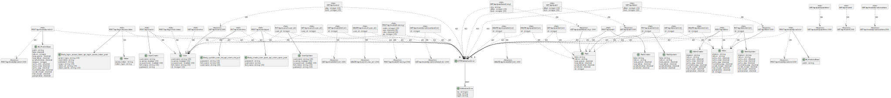

# JST PADI

Aplikasi Jaringan Syaraf Tiruan untuk memprediksi hasil produksi padi di kalimantan selatan menggunakan metode backpropagation.

# Frontend
 - Svelte@Sveltekit
 - Tailwindjs
 - DaisyUI
 - GridJS

## Backend

 - FastApi
 - Mysql
 - SQLAlchemy
 - Tensorflow < 2.7.0

## Screenshots

## KaTeX

You can render LaTeX mathematical expressions using [KaTeX](https://khan.github.io/KaTeX/):

The *Gamma function* satisfying $\Gamma(n) = (n-1)!\quad\forall n\in\mathbb N$ is via the Euler integral

$$
\Gamma(z) = \int_0^\infty t^{z-1}e^{-t}dt\,.
$$

> You can find more information about **LaTeX** mathematical expressions [here](http://meta.math.stackexchange.com/questions/5020/mathjax-basic-tutorial-and-quick-reference).

## UML diagrams
Class Diagram

